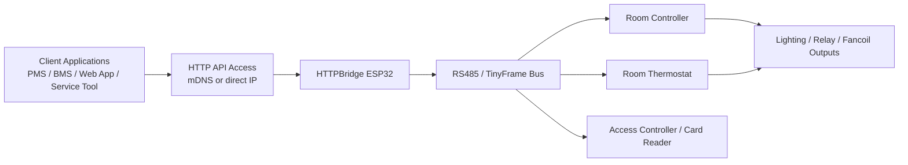

# HTTPBridge ESP32

<p align="center">
  
  
  
  
  
</p>

<p align="center">
  ESP32-based HTTP to RS485 bridge for room control, thermostat management, lighting, access workflows and field-ready integration.
</p>

<p align="center">
  <a href="#executive-summary">Executive Summary</a> &middot;
  <a href="#why-httpbridge">Why HTTPBridge</a> &middot;
  <a href="#key-capabilities">Key Capabilities</a> &middot;
  <a href="#architecture">Architecture</a> &middot;
  <a href="#technical-characteristics">Technical Characteristics</a> &middot;
  <a href="#quick-start">Quick Start</a> &middot;
  <a href="#api-overview">API Overview</a> &middot;
  <a href="#project-structure">Project Structure</a> &middot;
  <a href="#documentation">Documentation</a> &middot;
  <a href="#development-status">Development Status</a>
</p>

---

## Executive Summary

**HTTPBridge** is an ESP32-based **HTTP-to-RS485 gateway** designed for hotel rooms, apartments and other managed spaces where room controllers must be exposed through a simple, modern network interface.

The project bridges an existing **RS485 / TinyFrame control layer** with an easy-to-consume **HTTP API**, enabling software systems, maintenance tools and custom integrations to interact with room automation functions without dealing directly with low-level bus communication.

Typical use cases include:

- room thermostat monitoring and control
- lighting and output management
- outdoor relay and timer automation
- guest and staff access workflows
- controller diagnostics and service operations
- integration with supervisory or property-management software

This repository is intended to demonstrate not only working embedded functionality, but also a disciplined approach to **documentation, integration-readiness and maintainability**.

---

## Why HTTPBridge

In many installations, RS485-based room systems are reliable but difficult to expose cleanly to modern software.

**HTTPBridge** solves that by providing:

- a lightweight HTTP interface over local WiFi
- easier service and diagnostics access
- simpler third-party software integration
- faster deployment in real properties
- lower friction between embedded control and business software layers

Instead of forcing integrators to work directly with proprietary controller-level communication, HTTPBridge presents a practical application layer that is easier to test, document and automate.

---

## Key Capabilities

### Room climate control
- Read room temperature and setpoint
- Set target temperature remotely
- Switch thermostat modes between heating and cooling
- Enable or disable thermostat operation
- Access thermostat-specific flags and forwarded control behaviour

### Lighting and output control
- Read room controller output states
- Set individual output pins
- Control outdoor lighting relay manually
- Use automatic timer-based relay switching

### Access and guest workflows
- Open doors through controller commands
- Configure guest, maid, manager and service PINs
- Read access-related logs
- Delete processed logs where required

### Network and device configuration
- Configure WiFi credentials
- Change mDNS alias
- Change TCP/IP port
- Read current IP configuration
- Restart ESP32 bridge or downstream controller devices

### Autonomous embedded services
- RTC time handling
- optional NTP-backed time logic
- sunrise / sunset timer automation
- ping watchdog for network resilience
- persistent configuration storage in flash memory

---

## Architecture



### Integration flow

1. A client application or service tool sends an HTTP command.
2. HTTPBridge receives and parses the command on the ESP32.
3. The bridge translates the request toward the RS485 / TinyFrame bus.
4. Target room controllers execute the action or return data.
5. HTTPBridge returns a JSON response suitable for external systems.

This architecture makes the bridge useful both for direct field servicing and for higher-level integration scenarios.

---

## Technical Characteristics

| Category | Details |
|---|---|
| Core platform | ESP32 |
| Main role | HTTP to RS485 bridge |
| Network access | WiFi |
| Discovery | mDNS (`*.local`) |
| Transport interface | HTTP |
| Response format | JSON |
| Field provisioning | WiFiManager captive portal |
| Device integration | RS485 / TinyFrame-based room controllers |
| Supported control areas | thermostat, lighting, outputs, timers, access, logs |
| Time handling | RTC with optional synchronized logic |
| Scheduling | fixed time + `SUNRISE` / `SUNSET` timer options |
| Reliability features | ping watchdog, persistent flash configuration, restart commands |
| Local control features | thermostat logic, GPIO control, relay switching |
| Deployment model | local LAN gateway for room automation |
| Documentation assets | Markdown API docs, text command reference, PDF service guide |

---

## Quick Start

### 1. Flash the firmware
Upload the appropriate firmware build to the ESP32 device.

### 2. Reset WiFi settings if needed
Press and hold the **BOOT** button for more than **5 seconds**.

This clears saved WiFi settings and starts the **WiFiManager** portal:

- SSID: `WiFiManager`
- IP: `192.168.4.1`

### 3. Connect the device to your network
Use the portal to enter WiFi credentials and store the configuration.

### 4. Discover the bridge
The device can be reached by:

- **mDNS name**, for example `soba501.local`
- or **direct IP address**

> [!NOTE]
> Access through direct IP is usually faster than access through mDNS name resolution.

### 5. Send the first command

```bash
curl "http://soba501.local:8020/sysctrl.cgi?CMD=GET_STATUS"
```

---

## HTTP Command Format

The general command format is:

```text
http://<mdns-name-or-ip>:<port>/sysctrl.cgi?CMD=<COMMAND>[&PARAMETERS]
```

Example:

```text
http://soba501.local:8020/sysctrl.cgi?CMD=GET_ROOM_TEMP&ID=92
```

---

## API Overview

The project exposes a broad set of command groups for integration and field operations.

### System
- `GET_STATUS`
- `GET_IP_ADDRESS`
- `GET_TIME`
- `SET_TIME`
- `RESTART`
- `RESTART_CTRL`

### Network
- `GET_SSID_PSWRD`
- `SET_SSID_PSWRD`
- `GET_MDNS_NAME`
- `SET_MDNS_NAME`
- `GET_TCPIP_PORT`
- `SET_TCPIP_PORT`

### Room / Thermostat
- `GET_ROOM_TEMP`
- `SET_ROOM_TEMP`
- `GET_GUEST_IN_TEMP`
- `SET_GUEST_IN_TEMP`
- `GET_GUEST_OUT_TEMP`
- `SET_GUEST_OUT_TEMP`
- `GET_FAN_DIFFERENCE`
- `GET_FAN_BAND`
- `SET_THST_ON`
- `SET_THST_OFF`
- `SET_THST_HEATING`
- `SET_THST_COOLING`
- `SET_FWD_HEATING`
- `SET_FWD_COOLING`
- `SET_ENABLE_HEATING`
- `SET_ENABLE_COOLING`

### Pins / Outputs
- `GET_PINS`
- `SET_PIN`

### Lighting / Timer
- `GET_TIMER`
- `SET_TIMER`
- `OUTDOOR_LIGHT_ON`
- `OUTDOOR_LIGHT_OFF`

### Access / Logs
- `OPEN_DOOR`
- `SET_PASSWORD`
- `GET_PASSWORD`
- `READ_LOG`
- `DELETE_LOG`

### Watchdog
- `GET_PINGWDG`
- `PINGWDG_ON`
- `PINGWDG_OFF`

### Local ESP32 Thermostat
- `TH_STATUS`
- `TH_SETPOINT`

> [!TIP]
> The README intentionally provides a high-level API view. Full parameter definitions and JSON response structures are documented in the `doc/` directory.

---

## Example Requests

### Read full system status

```bash
curl "http://soba501.local:8020/sysctrl.cgi?CMD=GET_STATUS"
```

### Read room temperature

```bash
curl "http://soba505.local:8021/sysctrl.cgi?CMD=GET_ROOM_TEMP&ID=92"
```

### Set room temperature

```bash
curl "http://soba501.local:8020/sysctrl.cgi?CMD=SET_ROOM_TEMP&ID=92&VALUE=30"
```

### Open a door

```bash
curl "http://soba501.local:8020/sysctrl.cgi?CMD=OPEN_DOOR&ID=501"
```

### Configure outdoor light timer

```bash
curl "http://soba501.local:8020/sysctrl.cgi?CMD=SET_TIMER&TIMERON=SUNSET&TIMEROFF=SUNRISE"
```

---

## Example JSON Response

```json
{
  "status": "success",
  "message": "System status retrieved",
  "data": {
    "wifi": {
      "ssid": "WiFi0",
      "mdns": "soba504",
      "ip": "192.168.88.83",
      "port": 8020
    }
  }
}
```

---

## Operational Notes

> [!IMPORTANT]
> Some configuration changes such as WiFi credentials, mDNS alias and TCP/IP port are stored persistently and become fully effective after restart.

> [!WARNING]
> The `SET_PIN` command should be used with care. Output control is low-level and incorrect addressing or unsafe combinations may activate outputs that should not be driven simultaneously.

> [!NOTE]
> This project is intended for professional or controlled deployment environments where the mapping between controller IDs, room roles and hardware outputs is known in advance.

---

## Project Structure

```text
.
├── fw/    # ESP32 firmware and embedded implementation
├── sw/    # supporting software, utilities or integration-side tools
├── doc/   # detailed API and service documentation
└── README.md
```

This structure reflects the project goal of keeping firmware, software-side assets and documentation clearly separated.

---

## Documentation

Detailed documentation is available in the repository:

- [`doc/JSON_API_DOCUMENTATION.md`](doc/JSON_API_DOCUMENTATION.md) — structured JSON API reference
- [`doc/toplik HTTP ESP32 komande.txt`](doc/toplik%20HTTP%20ESP32%20komande.txt) — full command reference with examples
- `doc/Finalni Vodič_ Toplik Service.pdf` — service-oriented reference material

If you are integrating with the project for the first time, it is recommended to start with the README and then continue with the JSON API documentation.

---

## Intended Deployment Context

HTTPBridge is particularly suitable for:

- hotel room automation
- serviced apartments
- guest-room climate and access integration
- local maintenance tools
- retrofit scenarios where an RS485 layer already exists
- custom software integrations requiring practical field access to room controllers

---

## Technology Stack

Based on repository composition, the implementation spans:

- **C / C++** for firmware and embedded control logic
- **HTML** for lightweight interface or captive/network-facing components
- **Python** for support tooling or automation-related tasks

This mixed stack reflects the practical nature of the project: embedded control at the core, with supporting tooling and documentation around it.

---

## Development Status

**Status:** Active development

Current focus areas include:

- API consistency and coverage
- improved documentation quality
- clearer integration guidance
- refinement of thermostat and controller behaviour
- production-friendly presentation of technical assets

The goal is not only to maintain working firmware, but to present the project in a way that demonstrates engineering discipline, clarity and readiness for real-world deployment.

---

## Support

For questions, suggestions or issue reports, please use **GitHub Issues** in this repository.
